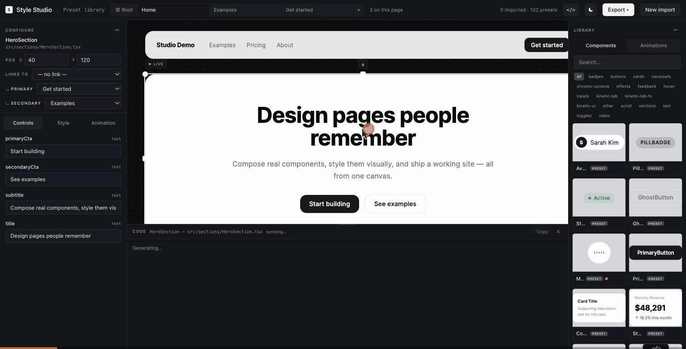
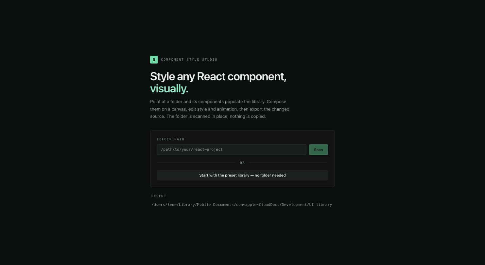

# Component Style Studio

A standalone visual tool for styling React components. Point it at an existing codebase (or
start with the bundled preset library), browse the components with live previews, compose them
on a canvas, edit their style and animation, and export the result — either as a self-contained
HTML demo or as the edited component source, ready to diff.

The folder you import is scanned in place. Nothing is copied.



## Features

- **Import any React codebase** — components populate a searchable, categorized library with
  live previews. No configuration; the studio reads your real `tsconfig`, Tailwind setup, and
  `node_modules`. Or start with the bundled preset library, no folder needed.
- **Compose on a canvas** — drag components in, then move, scale, stretch (change length on one
  axis), and rotate them Canva-style. Arrow keys nudge, `Delete` removes, `Esc` deselects.
- **Edit style and animation** — override text, color, background, and font; attach an entrance
  animation (fade, slide, scale, bounce) powered by GSAP.
- **See the generated code live** — your visual edits are written back into the component's real
  source by a narrow AST transform engine (style, text, position, animation only — never app
  logic), shown in a code pane as you work.
- **Export two ways** — a self-contained front-end HTML demo, or a `.zip` of the edited component
  source files (grouped per project, with a conflict report), ready to drop into a diff.



## Layout

| Path | What |
|---|---|
| `apps/studio` | The Studio app (Vite + React + TS + Tailwind v4) |
| `packages/registry` | Shared registry schema types (imported + preset components) |
| `packages/parser` | Import pipeline: file walk, `react-docgen-typescript` extraction, runtime-dependency flagging, and the `/api/scan` dev-server endpoint |
| `packages/preview` | Live preview engine: a child dev-server per project plus the iframe harness that renders and animates a component |
| `packages/presets` | The bundled preset component library |
| `packages/ast-sync` | AST sync engine: the edit transforms, the `/api/code` (live code) and `/api/export` (zip) endpoints, and a zero-dependency zip writer |

## Run

```bash
npm install
npm run dev        # studio at http://localhost:5173
npm test           # unit tests (vitest)
npm run lint       # oxlint
npm run typecheck
```

## How scanning works

Component scanning runs in the studio's **local dev server** (Node), not the browser:
`react-docgen-typescript` needs the TypeScript compiler plus the target folder's real
`node_modules`/`tsconfig.json` for full-fidelity prop extraction. The UI posts a folder path to
`/api/scan`; nothing from the scanned folder is written or copied.

Previews render the same way — each imported project gets its own child dev server, so a
component renders with its own real dependencies, CSS, and Tailwind config rather than a shim.
